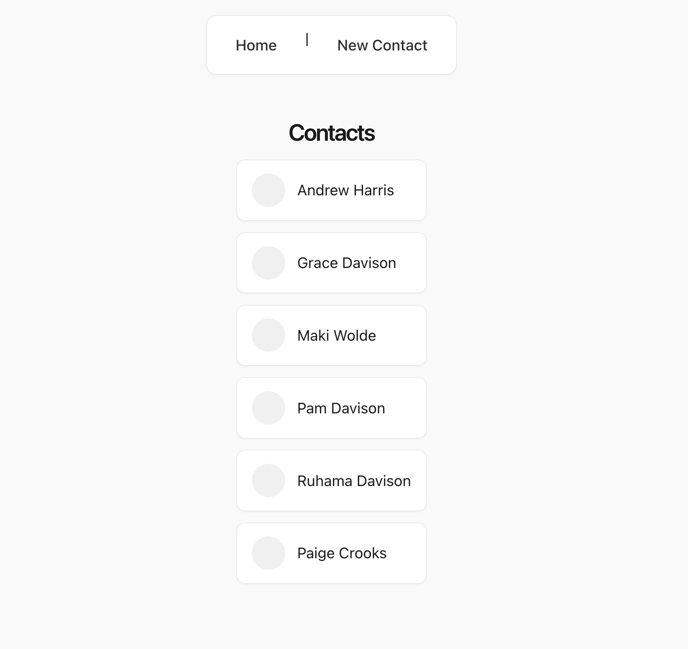

# Contact-List-App

Full-Stack PERN Project: Contact List App
A full‑stack contact management application built with React, Express, and PostgreSQL.
This project allows users to create, view, update, and delete contacts, as well as associate them with tags using a many‑to‑many relationship.

# Features

- Create new contacts
- View full contact details
- Edit existing contacts
- Delete contacts
- Add notes to contacts
- Assign tags (e.g., School, Work, Family)
- Many‑to‑many tag relationship
- Modern, minimal UI
- Fully RESTful backend API

# Tech Stack

Frontend

- React (Vite)
- React Router
- Fetch API

Backend

- Node.js
- Express.js
- PostgreSQL (pg library)
- Organized route structure (routes/ folder)

Database

- PostgreSQL
- Tables:
- contacts => Stores contact info
- tags => Stores tag names
- contact_tags => Join table for many‑to‑many relationship

# Backend Overview

Express Server

- Located in server/index.js\
- Uses: cors() express.json()
- Mounts routes from routes/contacts.js

Routes

- All contact CRUD routes live in: server/routes/contacts.js

Includes:

- GET /api/contacts — list all contacts
- GET /api/contacts/:id — get one contact + tags
- POST /api/contacts — create a contact
- PUT /api/contacts/:id — update a contact
- DELETE /api/contacts/:id — delete a contact

Database queries use pool.query() from db.js.

# Frontend Overview

App.jsx

- Sets up React Router
- Fetches all contacts from backend
- Stores contacts in state
- Renders pages: Home (Contacts list), View Contact, amd Create Contact

Contacts.jsx

- Displays list of contacts
- Each contact links to its detail page

ViewContact.jsx

- Fetches a single contact by ID
  Displays: Name | Email | Phone | Notes | Tags

CreateContact.jsx

- Form to add a new contact
- Sends POST request to backend

# Running the Project

1. Setup the database

   - psql -d contacts_db -f pg_dump.sql

2. Start the backend

   - cd server
   - node index.js
   - Server runs at:http://localhost:3000

3. Start the frontend
   - cd client
   - npm run dev
     -Frontend runs at:http://localhost:5173

# Screenshots

